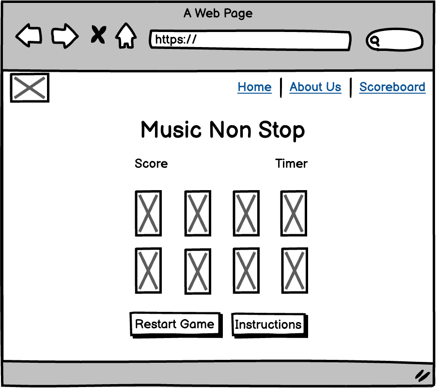
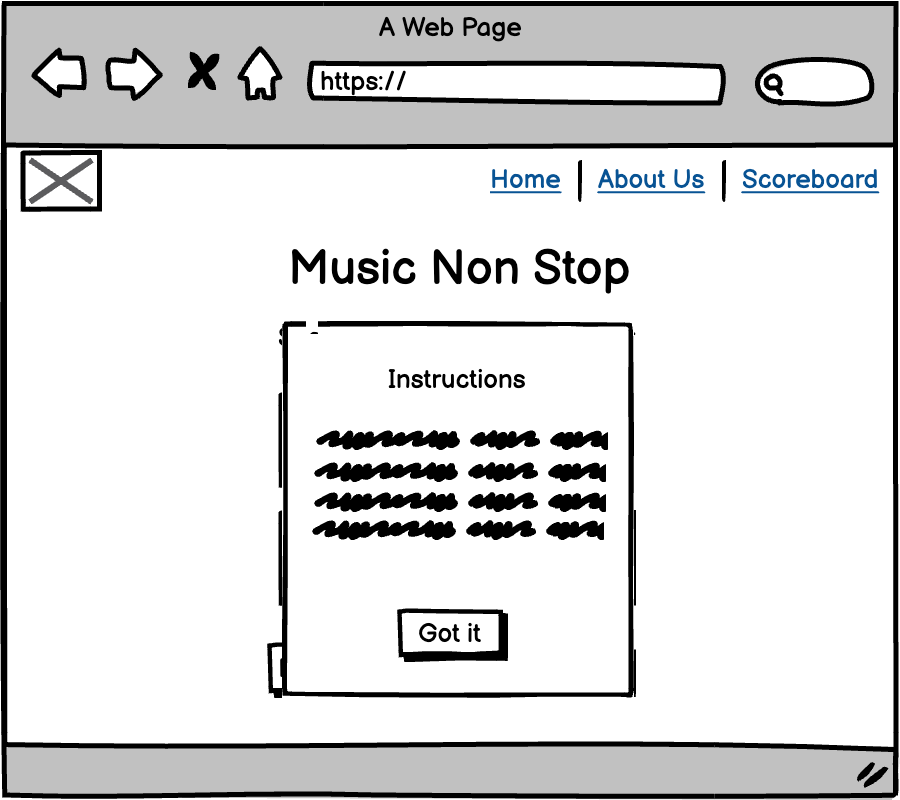
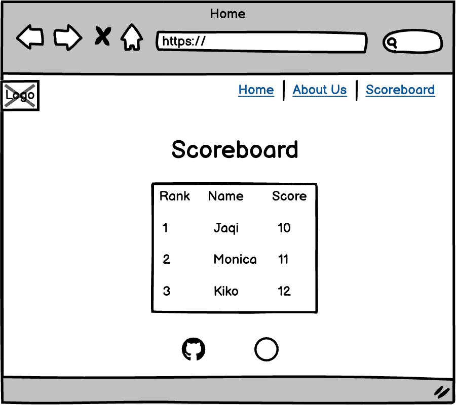

# Music Non Stop

#### Music Non Stop is a classical music-themed memory card game. Designed to enhance your memory while appreciating classical music.

#### Developed by Harmonic Hackers

## Game Overview
#### Music Non Stop is a card game that trains your brain to improve your memory while bringing the beauty of classical music to your ears. Designed for music lovers of all ages, this game challenges players to match pairs of cards that play the same classical tune. There are 24 cards featuring 12 unique pairs.

## How to Play:
#### 1. The game will start the timer as soon as you begin.
#### 2. Click on any two cards to flip them over and listen to the tunes.
#### 3. If the cards play the same tune, you have found a match. The cards will remain face up.
#### 4. If the cards do not match, they will flip back over after a short delay.
#### 5. Keep selecting two cards at a time, trying to remember the tunes and their locations.
#### 6. The game ends when all pairs have been matched.

## Scoring:
#### There is no specific scoring system; the goal is to match all pairs as quickly as possible.

## Tips for Success:
#### 1. Pay close attention to the tunes that each card plays.
#### 2. Try to remember the location of each tune to make matching easier.
#### 3. Practice makes perfect! The more you play, the better you’ll get at remembering the tunes.

## Goals:
#### As a developer, I want to create a repository and invite collaborators so that the project can be managed collaboratively and code can be version-controlled.
#### As a Scrum Master, I want to create a Kanban board so that tasks can be tracked and organized for better project workflow management.
#### As a developer, I want to create wireframes so that the layout and user flow are planned and validated before development.
#### As a developer, I want to create audio files so that the game has appropriate sound effects and music to enhance the user experience.
#### As a developer, I want to create a color palette so that the site has a cohesive and appealing visual identity.
#### As a developer, I want to choose typography so that the site has consistent and readable fonts that enhance user experience.
#### As a developer, I want to create a README file so that others can understand the project structure and purpose easily.
#### As a developer, I want to create game instructions so that users can quickly learn how to play and enjoy the game.
#### As a developer, I want to code the game logic so that the game functions according to the specified rules and provides an engaging experience.
#### As a developer, I want to create a 404 page so that users have a friendly and helpful experience when encountering a broken link.
#### As a developer, I want to create an About page so that users can learn more about the project and its creators.
#### As a developer, I want to create an index/landing page so that users are greeted with a clear and engaging introduction to the site.
#### As a developer, I want to create a global CSS structure so that the site's styles are organized and consistent across all pages.
#### As a developer, I want to add a favicon so that the site has a recognizable icon in the browser tab, enhancing brand identity.
#### As a developer, I want to deploy the site so that users can access and interact with the project online.
#### As a developer, I want to create a feedback form so that users can provide their thoughts and suggestions, helping to improve the site.
#### As a developer, I want to create or find images for the memory game cards so that the game is visually engaging and fun for players.
#### As a developer, I want to create a game landing page so that users have a visually engaging and functional entry point to the game.
#### As a player, I want my score and username to be saved in local storage, so that I can continue where I left off and track my performance over time.
#### As a player, I want to be asked a trivia or challenge question after successfully pairing cards so that I can earn extra points and add an additional layer of complexity and engagement to the game.
#### As a user/developer, I want a responsive navbar that transforms into a hamburger menu on smaller screens so that I can navigate the site easily regardless of the device I'm using. 

## User Stories:
#### As a music lover, I want to play a game that features classical music tunes, so that I can enjoy classical music while having fun.
#### As a parent, I want a game that is educational and entertaining for my children, so that they can improve their memory skills and develop an appreciation for classical music.
#### As a teacher, I want to use a game in my classroom that helps students improve their auditory memory and concentration, so that they can enhance their learning abilities in a fun and engaging way.
#### As a competitive player, I want a game that tracks my time and performance, so that I can challenge myself to improve and compete with friends and family.
#### As a classical music enthusiast, I want a game that includes a variety of famous classical pieces, so that I can test my knowledge and discover new music.

## Planning & Design
#### The development process for this project followed an Agile methodology, emphasizing continuous improvement throughout the development lifecycle. We assigned tasks to each other, which helped us distribute the workload efficiently and ensured clarity on responsibilities.

### Wireframes

### Colour palettes

# JavaScript Audio
I have created a class for playing audio files. Since we're going to use mp3-format I named it MP3Player. The class is defined in mp3-player.js.

## MP3Player

### Constructor
The constructor accepts two parameters **path** and **playlist**

**path** is the path to the folder with the mp3-files. The path is relative to the html document in which the script is loaded.
**playlist** is an array of audio file names without the extension. All files must be in mp3 format. Example 

<code>

// array with mp3 filenames
const playlist = { "symphony1", "symphony2", "mozart-track1", "bach-track1"};
// path to the folder with the files
const path = "./js/audio/"
// create an instance of the mp3-player
cont player = MP3Player(path, playlist);
// Pöay the first track from the list (which is symphony1.mp3)
player.play(1);

</code>

### Properties
audio
playBtn
stopBtn
prevBtn
nextBtn
tracks
audio_files_foler_path
trackIndex

### Methods
The class implements all the essential methods for playing mp3 files. Play.stop, pause, previous, next.

play(n)
stop()
pause()
prev()
next()

